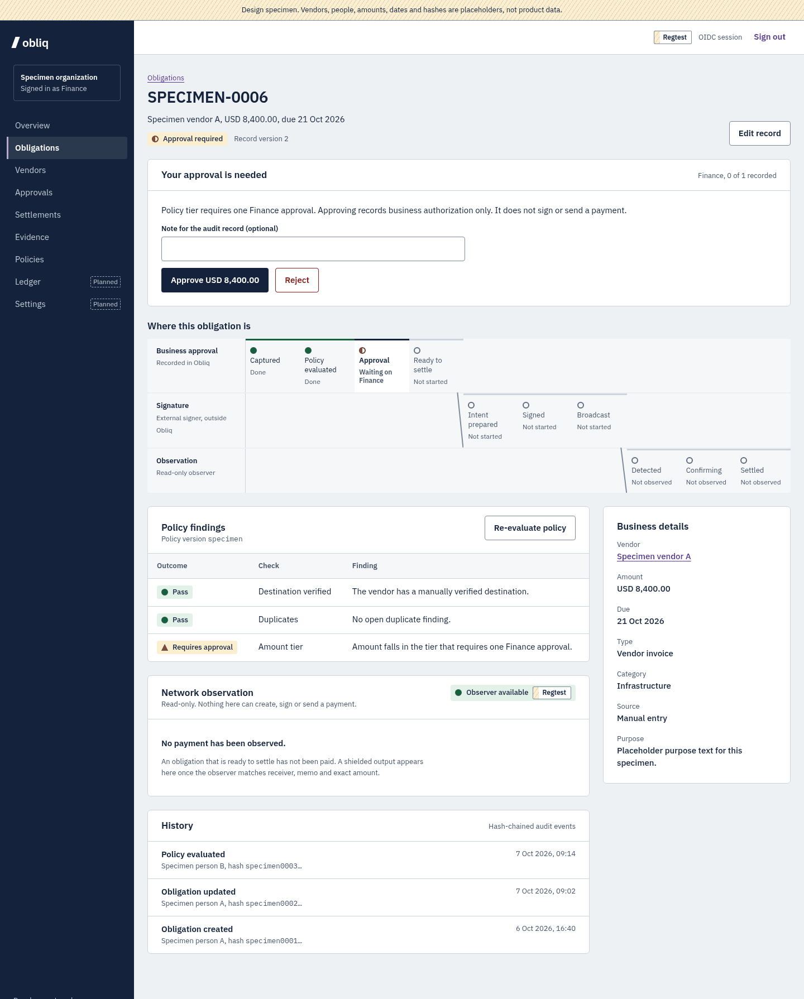
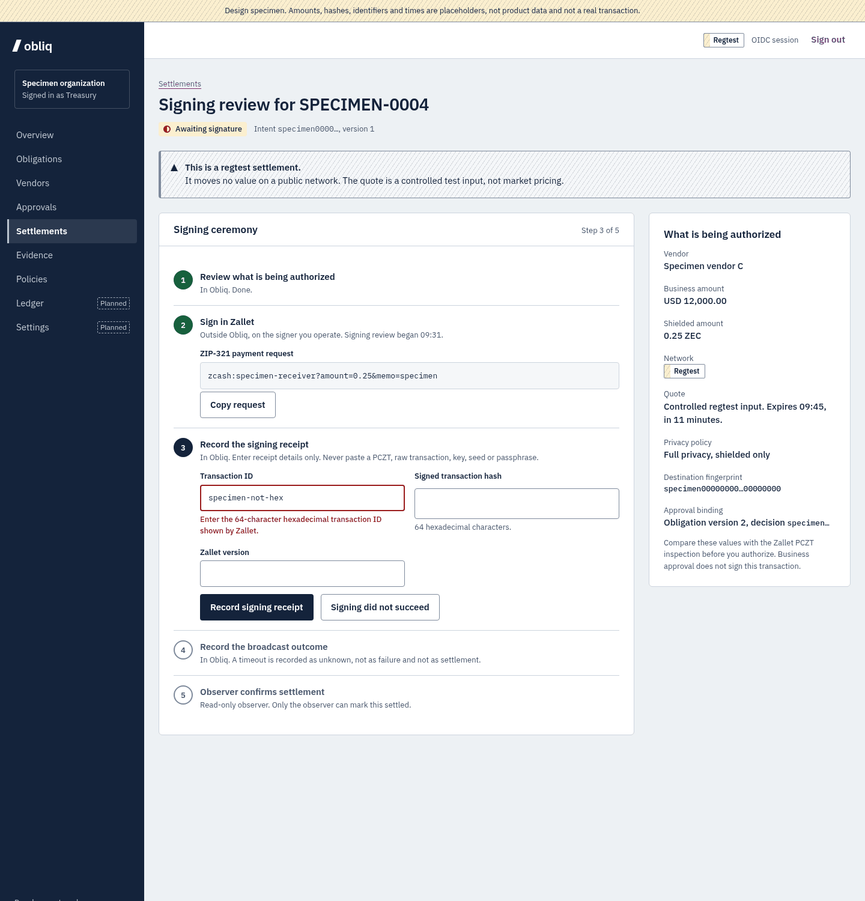
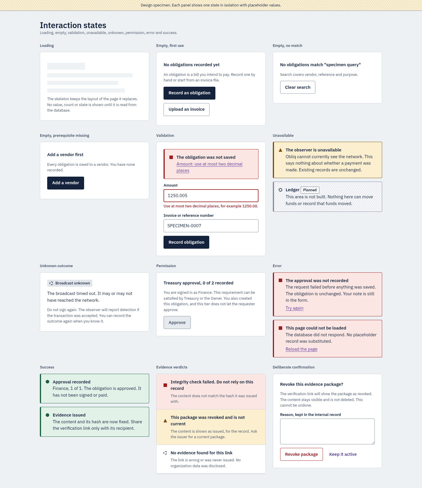

# Obliq design

**Status: proposed, awaiting owner review (issue #1).** Merging the pull request
that adds this folder records approval of the direction. Large-scale
implementation in `apps/web` should not begin before then.

This folder is research and design-system definition only. It changes no
application code, schema, authentication, policy, approval, settlement,
observer, signer, reconciliation or evidence behaviour.

## Contents

| File                                     | What it is                                                                                    |
| ---------------------------------------- | --------------------------------------------------------------------------------------------- |
| [`audit.md`](./audit.md)                 | Inventory of every current surface, the eight user journeys, and 52 findings by kind          |
| [`design-system.md`](./design-system.md) | The proposed system: direction, tokens, type, layout, components, states, and owner decisions |
| [`proposals/`](./proposals)              | Static HTML screens and the stylesheet that implements the tokens. Open any file in a browser |
| [`screens/`](./screens)                  | Desktop (1440px) and mobile (390px) screenshots of each proposal                              |

## The direction in brief

1. **Hatching marks what is not live.** Seeded, planned, unavailable, unknown
   and test-network content carries one oblique hatch. Solid means a persisted
   fact.
2. **Authority has lanes.** Business approval, signature and observation are
   drawn as three lanes with a hand-off between them.
3. **Hue means state.** Colour appears only where it reports a state, always
   with a shape and a word.
4. **Every record leads with the next action.**
5. **Capability and network terms are a fixed vocabulary.**

## Representative screens

All values in these screens are labelled placeholders. They are not product
data, customers, approvals, settlements or public-network results.

| Surface                                   | Proposal                                           | Desktop                                   | Mobile                                   |
| ----------------------------------------- | -------------------------------------------------- | ----------------------------------------- | ---------------------------------------- |
| Landing page (public)                     | [`landing.html`](./proposals/landing.html)         | [view](./screens/landing-desktop.png)     | [view](./screens/landing-mobile.png)     |
| Obligations list (workspace)              | [`obligations.html`](./proposals/obligations.html) | [view](./screens/obligations-desktop.png) | [view](./screens/obligations-mobile.png) |
| Obligation record (workspace)             | [`obligation.html`](./proposals/obligation.html)   | [view](./screens/obligation-desktop.png)  | [view](./screens/obligation-mobile.png)  |
| Signing review (workspace)                | [`settlement.html`](./proposals/settlement.html)   | [view](./screens/settlement-desktop.png)  | [view](./screens/settlement-mobile.png)  |
| Evidence verification (outside recipient) | [`verify.html`](./proposals/verify.html)           | [view](./screens/verify-desktop.png)      | [view](./screens/verify-mobile.png)      |
| Interaction states                        | [`states.html`](./proposals/states.html)           | [view](./screens/states-desktop.png)      | [view](./screens/states-mobile.png)      |
| Foundations and components                | [`foundations.html`](./proposals/foundations.html) | [view](./screens/foundations-desktop.png) | [view](./screens/foundations-mobile.png) |

### Obligation record

### Signing review

### Interaction states

## What the owner is asked to decide

Section 12 of [`design-system.md`](./design-system.md) lists eight decisions
with a recommendation for each. Three of them (D3, D4, D5) would change how a
server action or route handler returns its result, and are flagged so they are
reviewed on their own rather than folded into visual work.

## After approval

Implementation is split across the existing issues: #2 (landing and
onboarding), #3 (dashboard and financial operations) and #4 (evidence,
documentation, security and proof). Section 13 of the system document gives the
order of work.
