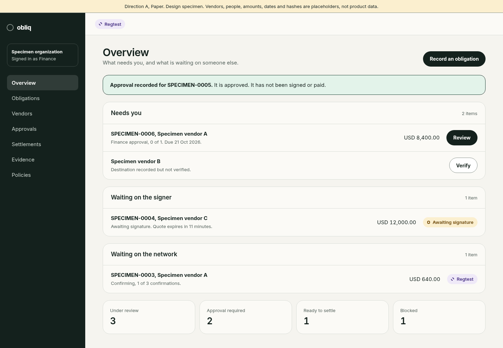
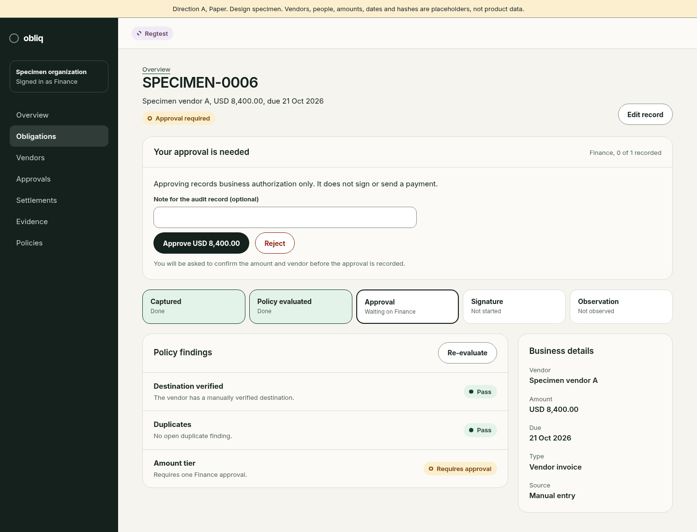
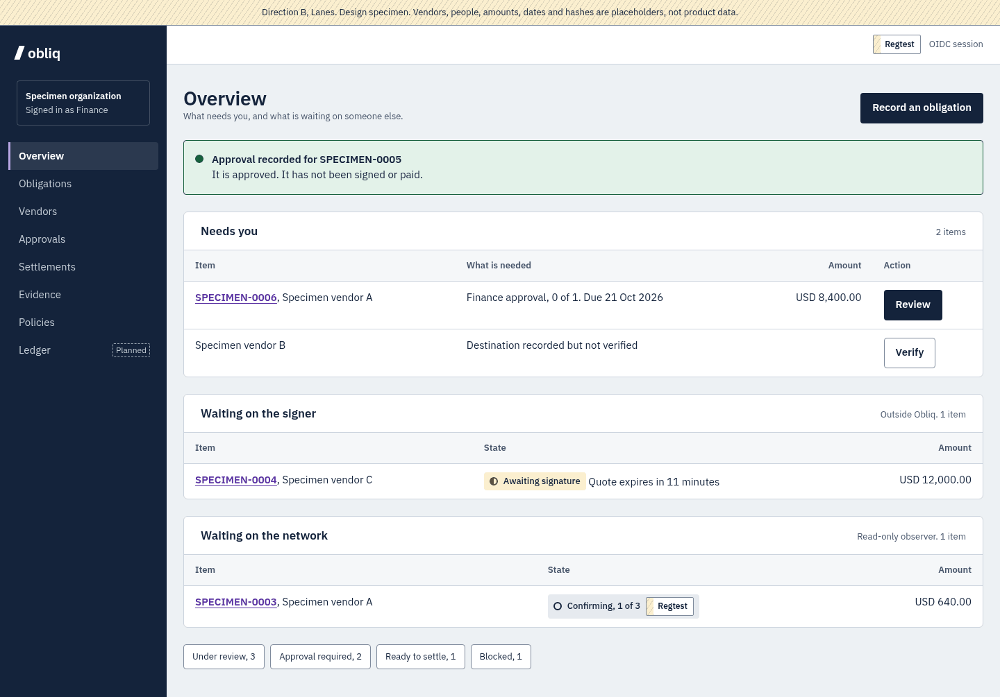
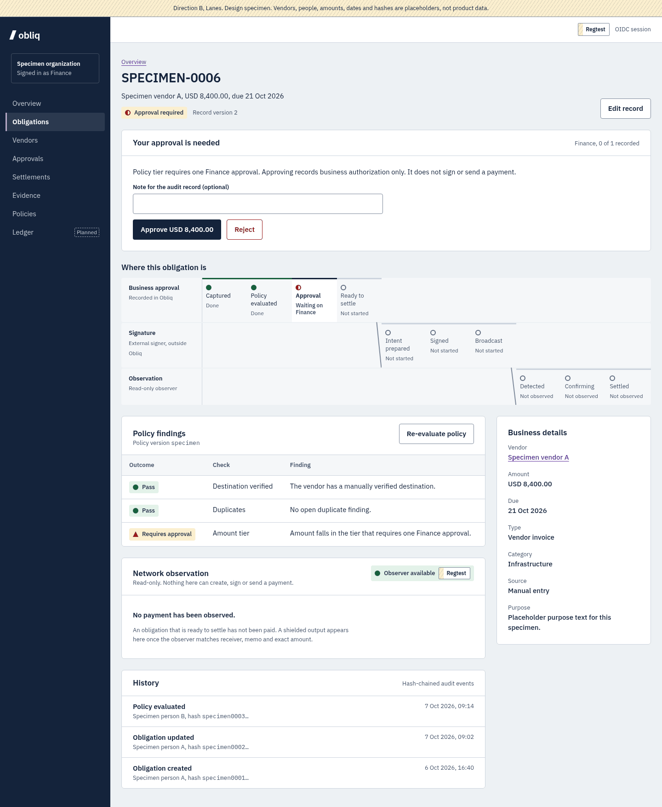
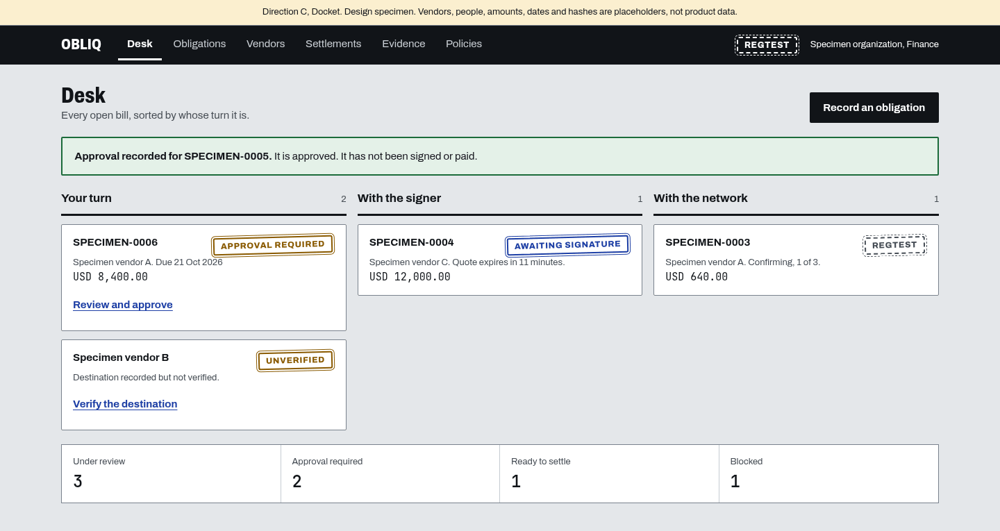
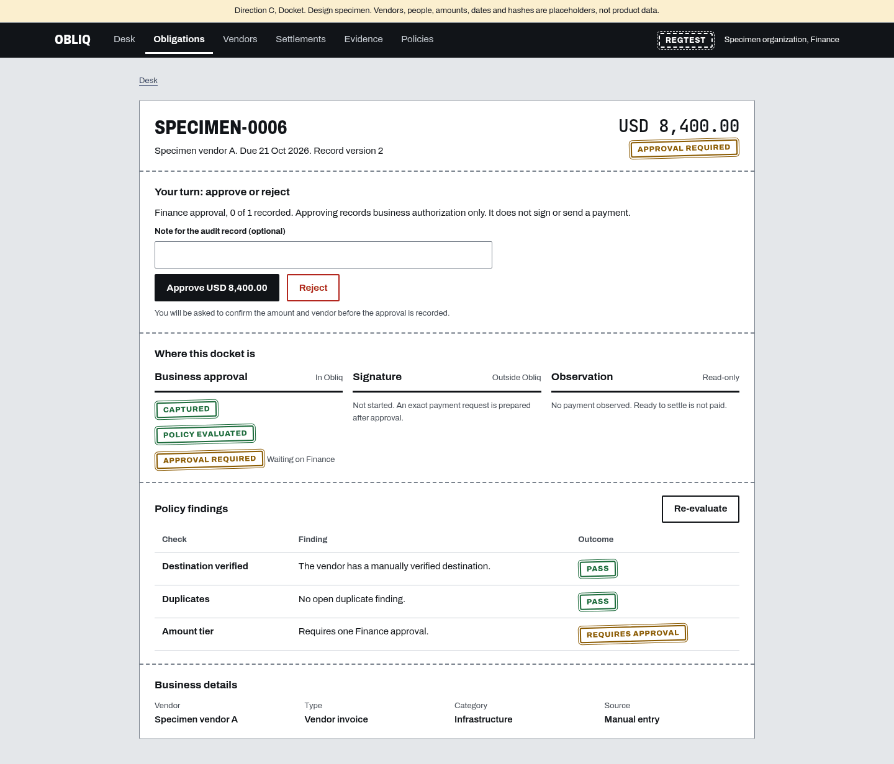

# Three design directions for Obliq

**Status: awaiting a decision.** This document presents three high-fidelity
directions for the landing page, the dashboard and the obligation detail, at
desktop (1440px) and mobile (390px), with their trade-offs and a
recommendation. Nothing here is implemented in `apps/web`.

All values in the screens are labelled placeholders. They are not product data,
customers, approvals or transactions.

## Design-decision summary

- **Recommended: Direction B, "Lanes".** It is the only direction whose
  signature idea is a product truth: one oblique hatch marks anything that is
  not live, so a regtest result can never look like a public one.
- **Adopt one idea from C in every direction:** the dashboard is grouped by
  whose turn it is (you, the signer, the network). All three dashboards below
  already do this.
- **A is the fallback** if the priority is the lowest migration cost. It is
  the least distinctive of the three.
- What does not change with the choice: the UX principles in section 5, the
  interaction-state rules, the network-status wording, and the fixes for the
  six high-severity audit findings in section 6.

## 1. The three directions at a glance

|                    | A. Paper                                      | B. Lanes                                             | C. Docket                                         |
| ------------------ | --------------------------------------------- | ---------------------------------------------------- | ------------------------------------------------- |
| Idea               | The current look, kept and corrected          | Hatching marks what is not live; authority has lanes | Every bill is a docket that crosses three desks   |
| Feel               | Warm, soft, approachable                      | Institutional, exact, quiet                          | Bold, tactile, operational                        |
| Background and ink | Warm paper `#F5F4EF`, green-black `#14211D`   | Cool grey `#EDF1F4`, navy `#14233B`                  | Stone `#E4E7EA`, black `#111418`                  |
| Interactive colour | Forest `#173F33`                              | Violet `#5A32A3`                                     | Ink blue `#1D3FA6`                                |
| Typeface           | Inter                                         | IBM Plex Sans, Serif and Mono                        | Archivo in two widths, JetBrains Mono for figures |
| Shape              | Pill buttons, 20px cards                      | 4px controls, flat bordered sheets                   | 2px corners, heavy 2px button borders             |
| Navigation         | Dark side rail                                | Dark side rail with network scope in the top bar     | Black top bar with tabs                           |
| Record state       | Rounded pill with a dot                       | Tag with a glyph shape                               | Ink stamp                                         |
| Test network       | Violet dashed-dot pill                        | Hatched scope tag                                    | Dashed stamp                                      |
| Obligation detail  | Stacked cards, five-step progress row         | Next-action panel, three-lane track                  | One docket sheet with three desk columns          |
| Source             | [`directions/a-paper/`](./directions/a-paper) | [`directions/b-lanes/`](./directions/b-lanes)        | [`directions/c-docket/`](./directions/c-docket)   |

## 2. Screens

| Surface           | A. Paper                                                                                                          | B. Lanes                                                                                                          | C. Docket                                                                                                         |
| ----------------- | ----------------------------------------------------------------------------------------------------------------- | ----------------------------------------------------------------------------------------------------------------- | ----------------------------------------------------------------------------------------------------------------- |
| Landing           | [desktop](./directions/screens/a-landing-desktop.png) · [mobile](./directions/screens/a-landing-mobile.png)       | [desktop](./directions/screens/b-landing-desktop.png) · [mobile](./directions/screens/b-landing-mobile.png)       | [desktop](./directions/screens/c-landing-desktop.png) · [mobile](./directions/screens/c-landing-mobile.png)       |
| Dashboard         | [desktop](./directions/screens/a-dashboard-desktop.png) · [mobile](./directions/screens/a-dashboard-mobile.png)   | [desktop](./directions/screens/b-dashboard-desktop.png) · [mobile](./directions/screens/b-dashboard-mobile.png)   | [desktop](./directions/screens/c-dashboard-desktop.png) · [mobile](./directions/screens/c-dashboard-mobile.png)   |
| Obligation detail | [desktop](./directions/screens/a-obligation-desktop.png) · [mobile](./directions/screens/a-obligation-mobile.png) | [desktop](./directions/screens/b-obligation-desktop.png) · [mobile](./directions/screens/b-obligation-mobile.png) | [desktop](./directions/screens/c-obligation-desktop.png) · [mobile](./directions/screens/c-obligation-mobile.png) |

The same content is used in every direction so they can be compared like for
like.

### A. Paper

### B. Lanes

### C. Docket

## 3. Each direction in detail

### A. Paper

Keeps what exists: warm paper, forest and mint, pill buttons and rounded cards.
It corrects the problems the audit found without changing the identity. The
blurred glow, translucent headers, decorative monospace and uppercase labels
are removed; control borders are darkened to 3:1; state pills gain a shape so
they do not rely on colour.

- **Tokens:** paper `#F5F4EF`, panel `#FBFAF6`, ink `#14211D`, muted `#55625C`
  (5.80:1 on paper), control border `#848F88` (3.04:1 on paper), forest
  `#173F33`, mint `#BFE8D0`, test `#4A2F8F` on `#EFE9F8` (8.44:1).
- **Type:** Inter. Display up to 88px at -0.04em; page title 30px; body 15px.
- **Components:** pill buttons; 20px-radius cards with a header row; rounded
  state pills with a ring, disc or square; row lists that never become wide
  tables; a five-box progress row on the record.

### B. Lanes

The system documented in full in [`design-system.md`](./design-system.md).

- **Tokens:** canvas `#EDF1F4`, surface `#FFFFFF`, ink `#14233B`, secondary
  `#47556B` (6.65:1 on canvas), control border `#7E8A9C` (3.08:1 on canvas),
  violet `#5A32A3` (8.68:1 on white), hatch at -55 degrees.
- **Type:** IBM Plex in three voices. Serif for statements of record, sans for
  the interface, mono for machine identifiers only.
- **Components:** capability stamp, hatched scope tag, state tag with glyph,
  next-action panel, three-lane authority track, ledger table that stacks
  below 720px, verdict bar for evidence.

### C. Docket

A bill is a docket. It sits on one of three desks: business approval, the
signer, or the network. The dashboard is those three desks side by side, so
"whose turn is it" is the layout rather than a column in a table. State is an
ink stamp, and a test-network stamp is dashed.

- **Tokens:** desk `#E4E7EA`, sheet `#FFFFFF`, ink `#111418`, secondary
  `#454C55` (7.00:1 on desk), control border `#79828D` (3.14:1 on desk), blue
  `#1D3FA6` (9.08:1), green `#1B6B3A` (6.54:1), red `#B3261E` (6.54:1), amber
  `#8A5A00` (5.93:1).
- **Type:** Archivo at 75% width and weight 800 for headings, normal width for
  text. JetBrains Mono for amounts and references, because this direction
  treats each record as a printed docket with aligned figures.
- **Components:** heavy square buttons; stamps with a double outline and a
  1.5-degree tilt; slips (one per open item) under a desk heading with a 3px
  rule; a single docket sheet divided by dashed tear lines; a black top bar
  with tabs.

## 4. Trade-offs

| Question                                | A. Paper                                            | B. Lanes                                                   | C. Docket                                                           |
| --------------------------------------- | --------------------------------------------------- | ---------------------------------------------------------- | ------------------------------------------------------------------- |
| How distinctive is it?                  | Low. Warm paper with rounded cards is a common look | High. The hatch rule and lanes belong to this product      | Highest. Desks and stamps are unlike other finance tools            |
| Does the identity say something true?   | No. It is a mood                                    | Yes. Hatch means "not live"; lanes are the authority model | Partly. Desks are the authority model; stamps are a metaphor        |
| Reads as serious finance software?      | Friendly more than institutional                    | Yes                                                        | Operational; the tilted stamps may read as playful to some          |
| Migration cost from today               | Lowest. Tokens and classes mostly stay              | Medium. New tokens, three components, a typeface           | Highest. New navigation model and page structure                    |
| Risk on small screens                   | Low                                                 | Medium. The lane track must restack; it does, as a list    | Medium. Three desks stack into one long column                      |
| Scales to more sections and denser data | Yes                                                 | Yes                                                        | The top bar holds about seven tabs; dense tables need a new pattern |
| Legibility of state                     | Good                                                | Best. Sentence-case label plus a shape                     | Uppercase stamps are slower to read in long lists                   |
| Risk of looking like a template         | Highest                                             | Low                                                        | Low                                                                 |
| Typeface cost                           | One family                                          | One superfamily, three styles                              | Two families                                                        |

## 5. What every direction keeps

These came from the audit and do not depend on the visual choice.

- **Next action first.** A record opens with what is needed, from whom, and
  what the action does and does not do.
- **Three authorities stay distinct.** Business approval, signing and
  observation are never merged into one progress bar or one colour.
- **State is never colour alone.** Every state has a shape or a stamp and a
  word.
- **No horizontal scrolling.** Tables restack into labelled rows.
- **Visible control boundaries.** Input and button borders are at least 3:1.
- **A test network never looks live.** Each direction has one unmistakable
  treatment for regtest: a dashed pill, a hatched tag, or a dashed stamp.
- **Targets of at least 44px, a skip link, one `h1`, labelled landmarks.**

## 6. The six high-severity findings

| Finding (audit id)                     | How every direction answers it                                                                                      | Where it is drawn                                              |
| -------------------------------------- | ------------------------------------------------------------------------------------------------------------------- | -------------------------------------------------------------- |
| Form input lost after an error (U2)    | Errors return to the form with a summary and a message under each field; input is preserved                         | `proposals/states.html`, Validation                            |
| No success feedback (U3)               | A status notice at the top of the page the action lands on, stating what was recorded and what has not happened yet | Top of every dashboard; `proposals/states.html`, Success       |
| One-click consequential actions (U5)   | The button names the amount; a confirmation step restates amount and vendor before anything is recorded             | Every obligation detail; `proposals/states.html`, Confirmation |
| Tables scroll sideways on a phone (R2) | Rows restack as labelled lines; no minimum table width                                                              | Every mobile dashboard and obligation screen                   |
| No navigation on mobile (R1, R4)       | A menu that lists every section and marks the current one (A, B); wrapping tabs (C)                                 | Every mobile screen                                            |
| Form boundaries at 1.24:1 (A1)         | Control borders at 3:1 or better in all three token sets                                                            | Note field on every obligation detail                          |

U2 needs server actions to return validation errors instead of throwing. That
is a behaviour change and is described, not implemented, in
[`proposed-behavior-changes.md`](./proposed-behavior-changes.md).

## 7. States, components and tokens

Loading, three kinds of empty, validation, confirmation, unavailable, unknown,
permission, error and success are drawn in
[`proposals/states.html`](./proposals/states.html)
([desktop](./screens/states-desktop.png), [mobile](./screens/states-mobile.png)).
They are drawn in Direction B. The rules for each state are in section 8 of
[`design-system.md`](./design-system.md) and apply to whichever direction is
chosen; only the skin changes.

Reusable components and tokens:

- **B:** documented in full in `design-system.md`, with a specimen sheet in
  [`proposals/foundations.html`](./proposals/foundations.html).
- **A and C:** tokens are the custom properties at the top of each
  `style.css`; components are listed in section 3 above. If A or C is chosen,
  the system document will be rewritten for it before any implementation.

## 8. Network and capability claims

Every direction shows the same four lines, each with its own label:

| Line                                     | Label in these screens | Why                                                             |
| ---------------------------------------- | ---------------------- | --------------------------------------------------------------- |
| Regtest shielded settlement              | Verified, on regtest   | Proven end to end on an isolated test network                   |
| Public testnet read-only synchronization | Blocked                | See the note below                                              |
| Public funded settlement                 | Not verified           | No funded shielded payment has been settled on a public network |
| Mainnet                                  | Blocked                |                                                                 |

**Note on the testnet line.** The review states that public testnet read-only
synchronization is qualified for a funded test. On the `main` branch this
design was made against, `parseRuntimeSecurityConfig` rejects every status
except `PUBLIC_NETWORK_BLOCKED`, and ADR 0010 classifies the public network as
blocked. The screens therefore show "Blocked". The label is designed as a
three-state component, and reads "Ready for funded test" when the runtime
status is `PUBLIC_NETWORK_READY_FOR_FUNDED_TEST`. Funded settlement stays "Not
verified" and mainnet stays "Blocked" in that state. The design does not state
a readiness the release does not report.

## 9. Recommendation

**Choose B, "Lanes".**

1. It is the direction in which the look carries the product's promise. Obliq's
   differentiator is that it never shows something as real when it is not. The
   hatch gives that promise one visible rule a user learns once.
2. It reads as institutional finance software without borrowing from a known
   product, and it avoids gradients, glass, shields and padlocks entirely.
3. It is fully specified already: tokens with computed contrast, components,
   states, and a display mapping for every obligation, settlement and evidence
   state.
4. Its cost is moderate, and it can be adopted page by page.

C is the more striking option and its desk layout is the best answer to "what
needs me now". That layout is not tied to stamps or a top bar, so B's dashboard
uses it. A is safe and inexpensive, and the least likely to make Obliq
recognisable.

If the owner prefers A or C, the UX principles, state rules and claim wording
carry over unchanged.

## 10. What happens after a decision

1. The chosen direction's system document is finalised (already done for B).
2. The landing page work in pull request #9 is aligned with it. That pull
   request already separates structure and logic from styling for this reason.
3. Dashboard and financial-operations screens follow under issue #3, and
   evidence, documentation, security and proof under issue #4.
